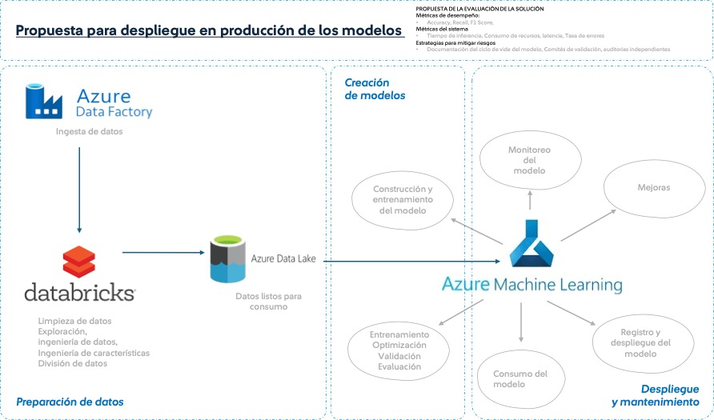

# 🧠 Brain Tumor Prediction API

Este proyecto tiene como objetivo predecir la probabilidad de un tumor cerebral utilizando:
- Notas clínicas escritas por médicos
- Imágenes médicas (MRI en formato JPG/PNG)

Se combinan dos enfoques de Machine Learning:
- Un modelo de lenguaje (Random Forest) entrenado con notas clínicas vectorizadas
- Un modelo de imágenes (CNN en Keras) entrenado con resonancias magnéticas cerebrales

---

## 📁 Estructura del Proyecto

```css
.
├── data/                       # Datos crudos o procesados
├── img/                        # Imágenes del modelo o arquitectura
│   ├── Modelo1.png
│   ├── Refinamiento1.png
│   ├── Refinamiento2.png
│   └── Refinamiento3.png
├── models/                     # Modelos entrenados
│   ├── vectorizer.pkl
│   ├── scaler.pkl
│   └── Checkpoint_Brain_Cancer.hdf5
├── notebooks/                  # Jupyter Notebooks de exploración y entrenamiento
│   ├── 1_BrainTumor_MRI_CNN_ClassificationImages.html
│   ├── 1_BrainTumor_MRI_CNN_ClassificationImages.ipynb
│   ├── 2_BrainTumor_MRI_TreatmentClassification.html
│   └── 2_BrainTumor_MRI_TreatmentClassification.ipynb
├── src/                        # Código fuente de la API
│   ├── main.py
│   ├── models_predicts.py
│   └── utils.py
```

## 🔍 Endpoints de la API
1. POST /predict
Realiza una predicción utilizando únicamente las notas clínicas del paciente.
```json
{
  "data": [
    {
      "Clinical Note": "Patient has headache and dizziness",
      "Age": 45,
      "Sex": "M"
    }
  ]
}
```
Respuesta esperada:
```json
{
  "results": [
    {
      "Clinical Note": "Patient has headache and dizziness",
      "Age": 45,
      "Sex": "M",
      "Prediction": "surgery"
    }
  ]
}

```


## 🧠 Modelos usados

A continuación, se describen los modelos utilizados en la API:

| Archivo                                   | Descripción                                             |
|------------------------------------------|---------------------------------------------------------|
| **`vectorizer.pkl`**                     | 🔤 `TfidfVectorizer` entrenado sobre notas clínicas     |
| **`scaler.pkl`**                         | 📊 `MinMaxScaler` usado para normalizar la edad         |
| **`modelo_random_forest_BrainTumorTreatment.pkl`** | 🌲 Modelo de `RandomForest` para notas clínicas      |
| **`Checkpoint_Brain_Cancer.hdf5`**       | 🧠 Modelo `CNN` en Keras entrenado con imágenes médicas |

## ⚙️ Instalación
1. Clona el repositorio:
2. Instala requerimientos
```pycon
pip install -r requirements.txt
```
3. Ejecuta la API:
```pycon
uvicorn src.main:app --reload
```
4. Accede a la documentación interactiva en:
- http://localhost:8000/docs
- http://localhost:8000/redoc

## Propuesta para despliegue en producción de los modelos 
🔍 Análisis del Caso
Este proyecto se desarrolla en un contexto donde la adopción de inteligencia artificial está en constante evolución. A continuación,
se identifican los principales retos técnicos, riesgos, y oportunidades, clave para guiar el diseño del sistema:

⚠️ Riesgos
- Disponibilidad de información: 
- Fuentes incompletas o limitadas.
- Integración con sistemas externos: dificultad para conectar la API con otros sistemas.
- Múltiples formatos de datos: necesidad de normalización y transformación.

🧩 Retos técnicos
- Sobreentrenamiento (Overfitting): modelo se ajusta demasiado a los datos de entrenamiento.
- Datos insuficientes: especialmente para tareas complejas o balanceadas.
- Desbalance de clases: sesgos o baja generalización en modelos de clasificación.
- Mantenimiento del modelo: adaptar el modelo frente al cambio de datos o contexto.

🌟 Oportunidades
- Modularidad: diseñar código escalable y reutilizable. (Se intento que fuera el codigo modular)
- Buenas prácticas de MLOps: automatización, trazabilidad y monitoreo continuo.
- Reutilización de modelos existentes: aprovechar modelos preentrenados (Transfer Learning).
- Adaptabilidad tecnológica: estar a la vanguardia con nuevas herramientas y frameworks de IA.
- Fine-tuning eficiente: personalización rápida de modelos con poco esfuerzo computacional.

  

---

## 👨‍💻 Autor

Este proyecto fue desarrollado por **[Valery Castañeda]**,  
Puedes contactarme en [valeryviviana95@gmail.com] o visitar mi perfil en [https://www.linkedin.com/in/valeryviviana/].


